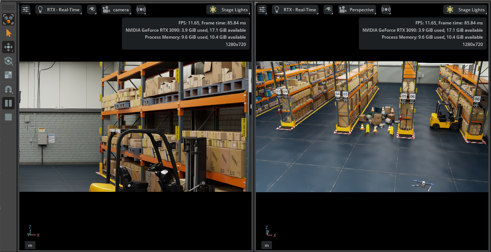
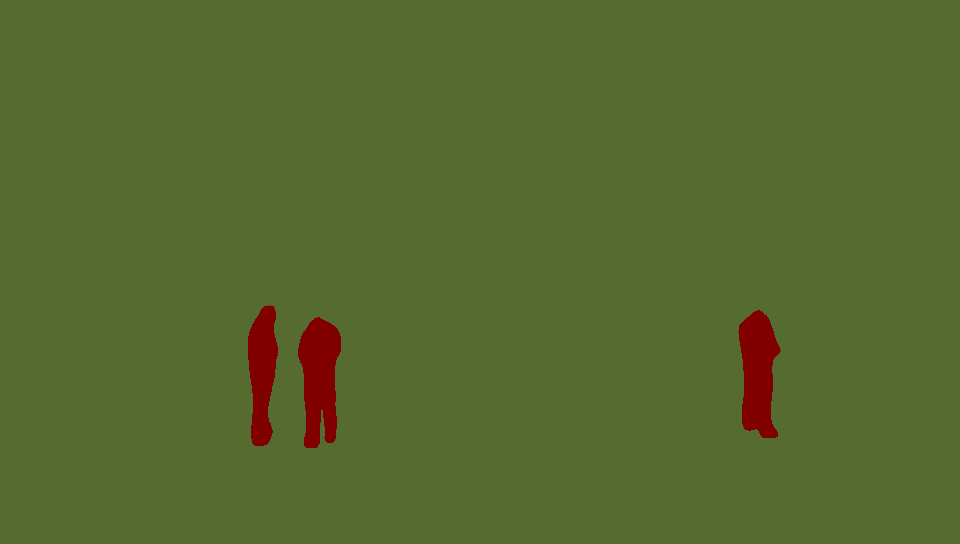
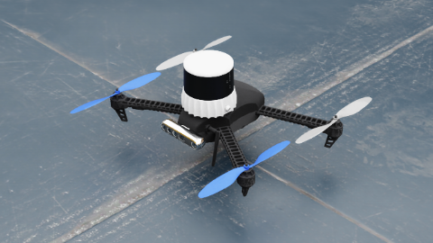
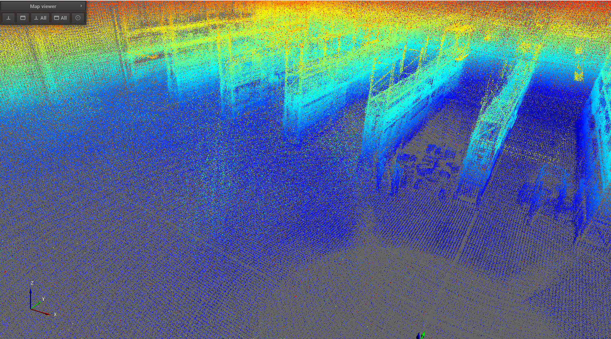

<p align="center">
  
</p>

<p align="center">
  
  
  
</p>

# 🛸 VSLAM Autonomous UAV Simulation Stack

An advanced, GPU-accelerated autonomous UAV simulation environment for **GPS-denied navigation**. This repository bridges **NVIDIA Isaac Sim**, **Pegasus Simulator**, and **PX4-Autopilot** with hardware-accelerated **NVIDIA Isaac ROS Visual SLAM** for high-fidelity simulation and perception testing.

---

## 💻 System Requirements

Before you begin, ensure your workstation meets the following bare-minimum specifications:

| Component | Minimum Requirement |
| :--- | :--- |
| **Operating System** | Ubuntu 22.04 LTS |
| **CPU** | Intel Core i7 (7th Gen) / AMD Ryzen 5 or better |
| **RAM** | 32 GB |
| **Storage** | 50 GB SSD available space |
| **GPU** | NVIDIA GeForce RTX 4080 (Recommended) |
| **GPU Driver** | NVIDIA Driver v580+ |

---

## 📦 Prerequisites & Installation

### 1. Core Core Docker Setup
Install Docker and complete the [Docker Linux Post-Installation Steps](https://docs.docker.com/engine/install/linux-postinstall/) to manage containers without `sudo`.

Verify your installation:
```bash
docker run hello-world
```

### 2. Clone This Repository
Clone the core simulation packages into your local workspace:
```bash
git clone (https://github.com/bandofpv/VSLAM-UAV)
```

### 3. NVIDIA Container Toolkit
Install the NVIDIA Container Toolkit to enable GPU acceleration inside your Docker containers. (https://docs.nvidia.com/datacenter/cloud-native/container-toolkit/latest/install-guide.html)

### 4. Simulator Suite Setup
- NVIDIA Isaac Sim: Install Isaac Sim (Version 5.1.0) along with its structural assets following the official Isaac Sim Installation Guide. (https://docs.isaacsim.omniverse.nvidia.com/5.1.0/installation/requirements.html)
- Pegasus Simulator: Clone and build the Pegasus Simulator extension.
- Cross-linking: Configure the connection layer between Isaac Sim and Pegasus Simulator. (https://github.com/PegasusSimulator/PegasusSimulator)
- Robot Asset Injection: Copy the modified custom asset file Iris_VSLAM.usd included in this repository to your local directory layout:
```bash
cp Iris_VSLAM.usd /home/mummtaz/PegasusSimulator/extensions/pegasus.simulator/pegasus/simulator/assets/Robots/
```

### 5. Autopilot & GCS Setup
- Clone and build the PX4-Autopilot firmware ecosystem. (https://github.com/PX4/PX4-Autopilot.git)
- Establish the hardware-in-the-loop connection profile between Isaac Sim and the PX4-Autopilot framework.
- Download and install the QGroundControl application.

### 6. NVIDIA Isaac ROS Architecture
Install NVIDIA Isaac ROS Core Components. (https://nvidia-isaac-ros.github.io/getting_started/index.html) 
- In this project we used Segmentation part for segmenting Human-object inside of the simulation environment

### 7. MOLA Architecture
Install MOLA ROS2 library inside the Linux system. (https://docs.mola-slam.org/latest/) 
- In this project we used 3D LiDAR-odometry mapping inside of the simulation environment

## 🛠️ Checking
Import and run simulation of the usd file inside of the /SLAM-LIDAR folder to test whether the drone .USD file already working or not

## 🚀 Runtime Execution & Simulation Launch
To launch the full pipeline, orchestrate your execution using 4 independent terminal sessions:
- 🖥️ Terminal 1: Ground Control Station
Open the QGroundControl interface to track telemetry and missions:
```bash
# Launch QGroundControl executable
./QGroundControl.AppImage
```

- 🖥️ Terminal 2: Isaacsim App and Pegasus Simulator
Open Isaacsim app and import the drone .USD files:
- Put the Iris_LiDAR folder from the repo into Pegasus Simulator repo Assets folder
- Run the Isaacsim
- Inside of the Isaacsim software you can use the Pegasus Simulator plugins to load desired Environment and load the Iris_LIDAR drone
- Start the simulation

- 🖥️ Terminal 2: MOLA LiDAR Odometry
Launch the MOLA LiDAR launch file using built-in ROS2 launch command:
```bash
ros2 launch mola_lidar_odometry ros2-lidar-odometry.launch.py lidar_topic_name:=/point_cloud
```

- 🖥️ Terminal 3: Isaac ROS Segmentation Engine
Install and run the IsaacROS segmentation package by following the step inside of the nvidia-isaac-ros documentation (https://nvidia-isaac-ros.github.io/repositories_and_packages/index.html)

## 🏁 Final Step
Fly the drone around the environment to capture the whole features there to make a good resolution 3D map.


